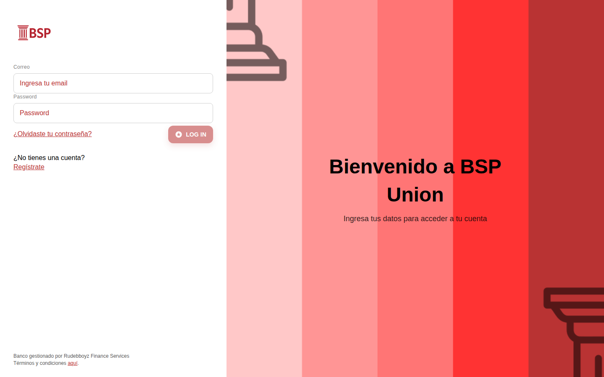
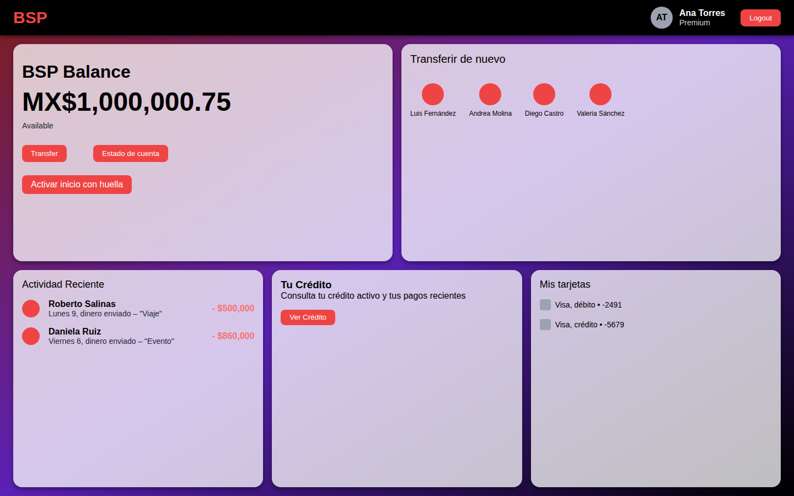
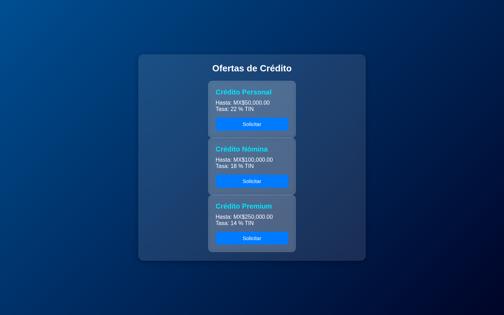
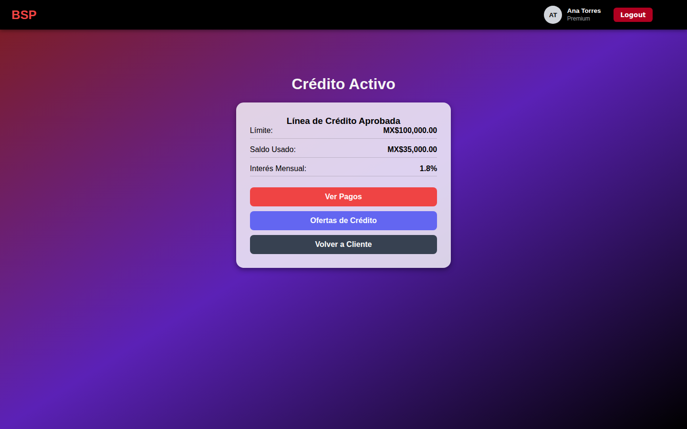
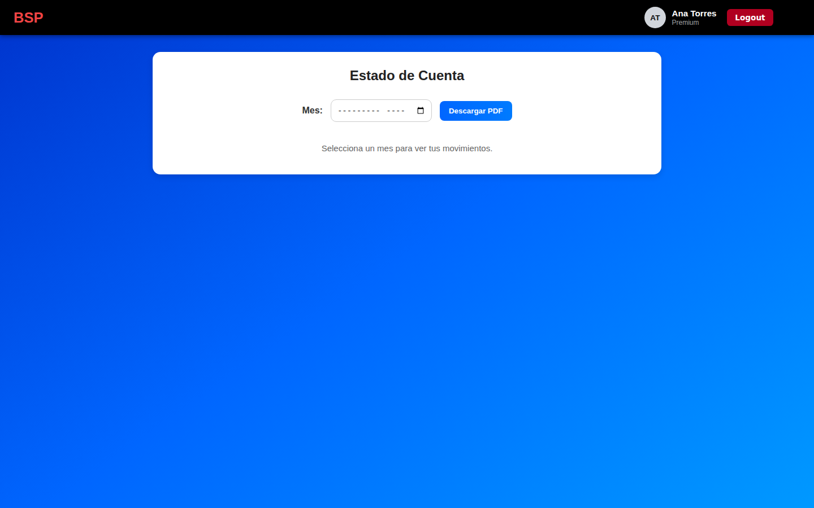
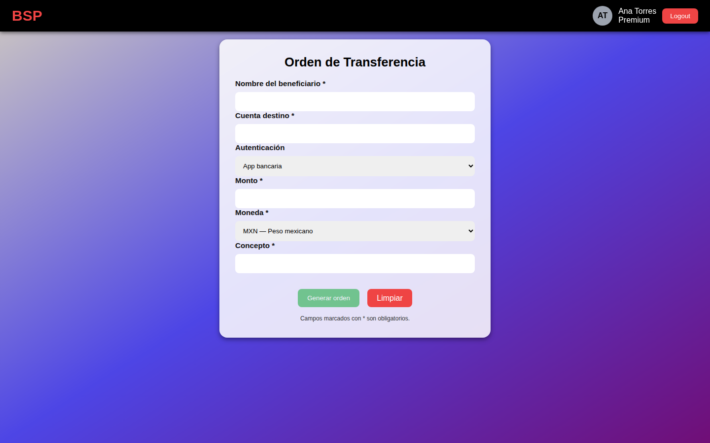
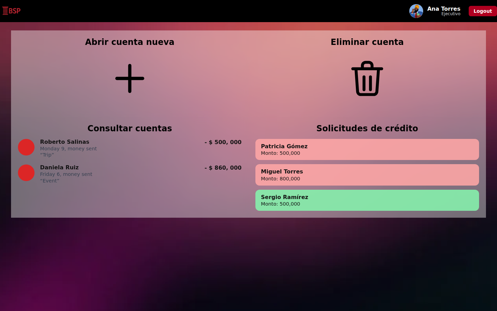
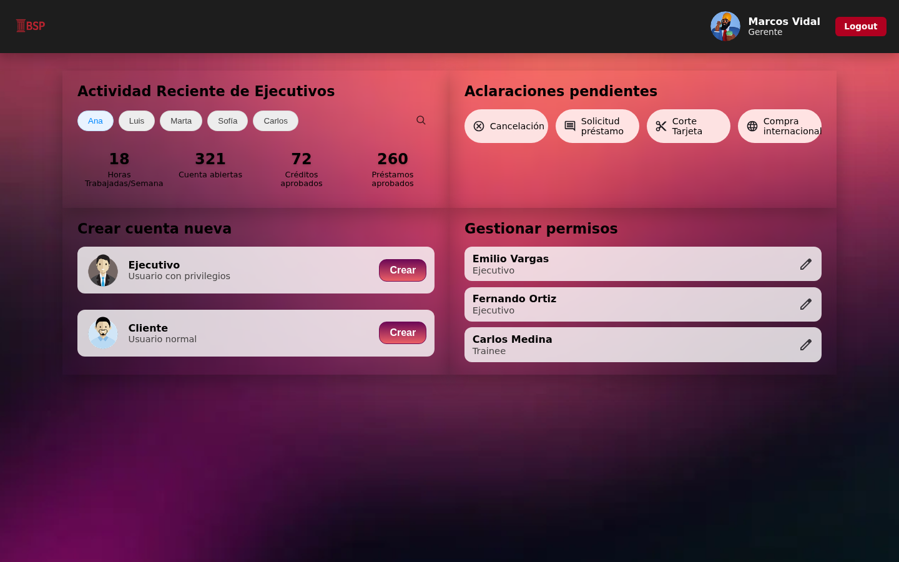

# BSPBank

Aplicación de banca digital ficticia ("BSP Union") con paneles separados para cliente, ejecutivo y gerente, autenticación con JWT, inicio de sesión biométrico (WebAuthn) y flujos completos de crédito y transferencias. Frontend en Angular, backend en Express + MySQL.



## Sobre el proyecto

BSPBank simula el panel de un banco con tres roles de usuario, cada uno con su propia vista y permisos. Empezó como proyecto de equipo para la universidad; yo lideré el desarrollo e implementé la mayor parte del frontend, el backend y la integración entre ambos.

A diferencia de un mockup, aquí hay lógica real: autenticación con JWT, guards de ruta por rol, un backend en Express con MySQL, correo de recuperación de contraseña, generación de PDFs y soporte para inicio de sesión biométrico vía WebAuthn.

## Funcionalidades

- **Autenticación:** login con email y contraseña, JWT con expiración, recuperación y cambio de contraseña por correo.
- **Biometría (WebAuthn):** alta, baja y verificación de huella o Face ID como método de acceso alterno.
- **Control de acceso por rol:** cada ruta valida sesión y rol (`cliente`, `ejecutivo`, `gerente`) antes de permitir el paso; redirige a `/login` conservando el destino, o a `/forbidden` si el rol no corresponde.
- **Panel Cliente:** saldo, transferencias frecuentes, actividad reciente, tarjetas y estado de cuenta.
- **Crédito:** catálogo de ofertas, validación de elegibilidad contra el ingreso declarado, simulador de cuota (sistema francés), seguimiento del crédito activo y registro de pagos.
- **Transferencias:** envío con validación de saldo, pantalla de confirmación y comprobante en PDF descargable.
- **Panel Ejecutivo:** apertura y cierre de cuentas, consulta de cuentas, solicitudes de crédito.
- **Panel Gerente:** actividad de ejecutivos, aclaraciones pendientes, gestión de permisos.
- **Alta de cliente:** formulario con validación en el cliente y documentos de identidad.

## Capturas

**Panel Cliente**


**Ofertas de crédito**


**Crédito activo**


**Estado de cuenta**


**Transferencia**


**Panel Ejecutivo**


**Panel Gerente**


## Stack técnico

**Frontend**

- [Angular 20](https://angular.dev/) con componentes standalone
- Angular Router con guards funcionales (`CanActivateFn`)
- RxJS + `HttpClient` con interceptor que adjunta el JWT a cada petición
- `jwt-decode` para leer el payload del token (id, email, rol y expiración)
- Karma + Jasmine para las pruebas unitarias

**Backend** (`/backend`)

- Node.js + Express
- MySQL (`mysql2`) con consultas parametrizadas
- `bcrypt` para el hash de contraseñas, `jsonwebtoken` para las sesiones
- `@simplewebauthn/server` para el registro y verificación biométrica
- `nodemailer` para el correo de recuperación
- `pdfkit` para los comprobantes y el estado de cuenta en PDF

## Decisiones de seguridad

El proyecto maneja datos financieros simulados, así que el control de acceso se trató como parte del diseño y no como un añadido:

- **La identidad sale siempre del JWT, nunca de la URL o del body.** Los endpoints que reciben un `:userId` comparan contra el token y responden `403` si no coinciden, para que nadie pueda leer el estado de cuenta de otra persona cambiando un número en la URL.
- **Descarga de comprobantes autenticada y con nombre validado** contra un patrón fijo, de modo que la ruta del archivo no se pueda manipular para salir de su carpeta.
- **El registro biométrico exige sesión iniciada** y toma el correo del token: así nadie puede vincular su huella a una cuenta ajena.
- **Contraseñas con `bcrypt`** y consultas parametrizadas en todas las llamadas a MySQL.
- **Los importes se validan en el servidor:** una transferencia exige un monto positivo, saldo suficiente y respeta el límite por operación. Sin esa validación, un monto negativo invertía la operación y aumentaba el saldo del emisor.
- **Las transferencias corren en una transacción** con bloqueo de fila (`SELECT … FOR UPDATE`), de modo que dos operaciones simultáneas no puedan dejar la cuenta en números rojos. El comprobante y el correo se generan después de confirmarla: si fallan, no revierten un movimiento que ya ocurrió.
- **En producción el servidor no arranca sin `JWT_SECRET`**, para no firmar tokens con un valor por defecto conocido, y CORS sólo acepta los orígenes declarados.
- **Ningún secreto en el repositorio:** `backend/.env` está en `.gitignore` y se documenta con `backend/.env.example`.

## Cómo correrlo localmente

Requisitos: Node.js 20 o superior, npm y MySQL 8 (o MariaDB 10.6+).

**1. Base de datos**

```bash
mysql -u root -p -e "CREATE DATABASE bspbank CHARACTER SET utf8mb4 COLLATE utf8mb4_unicode_ci;"
mysql -u root -p bspbank < backend/db/schema.sql
mysql -u root -p bspbank < backend/db/seed.sql     # datos de ejemplo (opcional)
```

**2. Backend**

```bash
cd backend
npm install
cp .env.example .env   # completa DB_USER, DB_PASS y JWT_SECRET
npm start
```

Escucha en `http://localhost:3000`. `GET /health` responde si la base está conectada.

**3. Frontend**

```bash
npm install
npm start
```

Abre `http://localhost:4200`.

> El repositorio no incluye ningún `.env` real: usa `backend/.env.example` como plantilla.

### Cuentas de prueba

Las crea `backend/db/seed.sql`. Son credenciales públicas de demostración.

| Rol | Correo | Contraseña |
|---|---|---|
| Cliente | `cliente@bspbank.mx` | `Cliente123` |
| Ejecutivo | `ejecutivo@bspbank.mx` | `Ejecutivo123` |
| Gerente | `gerente@bspbank.mx` | `Gerente123` |

El cliente viene con saldo, movimientos del mes en curso, dos tarjetas y un crédito activo con pagos, para que las pantallas no se vean vacías. Hay un segundo cliente (`cliente2@bspbank.mx`, misma contraseña que el primero) que sirve como cuenta destino para probar una transferencia: usa el número de cuenta **2** en el campo de destino.

## Despliegue

La aplicación son dos piezas independientes: el frontend es estático y el backend necesita Node y MySQL.

**Backend.** Define estas variables en el proveedor (Railway, Render, Fly…):

| Variable | Para qué |
|---|---|
| `NODE_ENV=production` | Exige `JWT_SECRET` y restringe CORS |
| `DB_HOST` `DB_PORT` `DB_USER` `DB_PASS` `DB_NAME` | Conexión a MySQL |
| `JWT_SECRET` | Firma de los tokens; genera uno con `openssl rand -base64 48` |
| `APP_URL` | URL pública del frontend |
| `CORS_ORIGINS` | Orígenes permitidos, separados por comas |
| `RP_ID` / `WEBAUTHN_ORIGIN` | Dominio y origen para WebAuthn (por defecto se derivan de `APP_URL`) |

Carga el esquema apuntando a la base del proveedor:

```bash
mysql -h HOST -u USER -p NOMBRE_DB < backend/db/schema.sql
```

`schema.sql` no crea ni borra la base de datos, precisamente para que se pueda ejecutar contra una base administrada donde no se tiene ese permiso.

**Frontend.** Pon la URL pública del backend en `src/environments/environment.prod.ts`, compila y publica el contenido de `dist/BSPBank/browser` en cualquier hosting estático:

```bash
npm run build
```

Al ser una SPA, el servidor debe redirigir las rutas desconocidas a `index.html`; si no, recargar en `/cliente` devuelve 404.

**Notas para producción:**

- **WebAuthn exige HTTPS** (salvo en `localhost`) y que `RP_ID` sea exactamente el dominio del frontend. Si no coinciden, el navegador rechaza la credencial.
- El **almacén de challenges de WebAuthn vive en memoria**, así que sólo funciona con una instancia del backend. Con varias réplicas hay que moverlo a Redis o a la base de datos.
- Los **comprobantes en PDF se guardan en disco**. En plataformas con sistema de archivos efímero se pierden al reiniciar: para conservarlos habría que usar almacenamiento de objetos (S3 o similar).
- El correo usa credenciales de Gmail. Si `EMAIL_USER` y `EMAIL_PASS` van vacíos la app funciona igual, sólo no envía correos.

## Pruebas

```bash
npm test        # modo interactivo, con navegador
npm run test:ci # headless, para CI
```

Cubren el servicio de sesión (token válido, expirado y corrupto; resolución de rol), los tres guards de ruta, el interceptor de autenticación y los servicios de crédito y cliente. El workflow de GitHub Actions (`.github/workflows/ci.yml`) corre las pruebas y el build de producción en cada push.

## Estructura del proyecto

```
src/app/
├── core/                       # Servicios transversales
│   ├── auth.service.ts           # Sesión: token, rol, expiración
│   ├── auth.interceptor.ts       # Adjunta el JWT a cada petición
│   ├── guards.ts                 # authGuard, roleGuard, guestOnlyGuard
│   ├── client.service.ts         # Datos del cliente (con caché compartida)
│   ├── webauthn.service.ts       # Alta, baja y login biométrico
│   ├── toast.service.ts          # Notificaciones
│   └── services/                 # Crédito y estado de cuenta
├── shared/toast/               # Componente de notificaciones
├── models/                     # Tipos de crédito y estado de cuenta
├── cliente/                    # Panel de cliente
├── pages/
│   ├── login/  formulario/  password-change/  reset-password/
│   ├── ejecutive/  gerente/
│   ├── credit-offers/  credit-request/  credit-active/  credit-payments/
│   ├── account-statement/  transfer/  transfer-success/
│   ├── home/                   # Redirige al panel según el rol
│   └── forbidden/              # Página 403
├── app.routes.ts               # Rutas y guards
└── main.ts                     # Bootstrap, providers e interceptor

src/environments/               # apiUrl por entorno (dev / producción)

backend/
├── server.js                   # API Express
├── db/
│   ├── schema.sql              # Esquema de la base de datos
│   └── seed.sql                # Datos de ejemplo (cuentas de prueba)
└── .env.example                # Plantilla de variables de entorno
```

## Próximos pasos

- Endpoints propios para los paneles de ejecutivo y gerente: hoy sus tarjetas muestran datos de ejemplo.
- Pruebas end-to-end de los flujos de login, crédito y transferencia.
- Mover el almacén de *challenges* de WebAuthn de memoria a Redis o a la base de datos, para que funcione con más de una instancia del servidor.
- Desplegar una demo pública con una base de datos de prueba.

## Créditos

Este proyecto nació como trabajo en equipo para la universidad. Yo ([@Juanpineda77](https://github.com/Juanpineda77)) lideré el desarrollo —frontend, backend e integración— junto con dos compañeros que colaboraron en partes puntuales del proyecto original.

## Licencia

MIT — ver [LICENSE](LICENSE).
